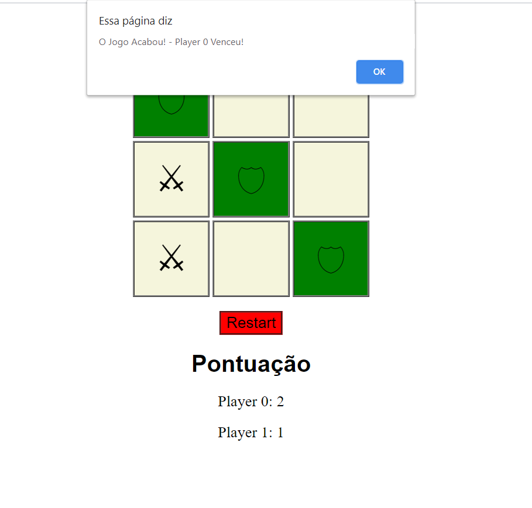

# Jogo da Velha

--1° projeto feito em HTML, CSS e JavaScript!
--Este projeto foi feito no curso de Desenvolvimento Web Full Stack - ProgBr.
--Porém, as partes de Pontuação, Sinalização pela cor verde do ganhador e Ícones do Escudo e da Espada foram desenvolvidas por mim.